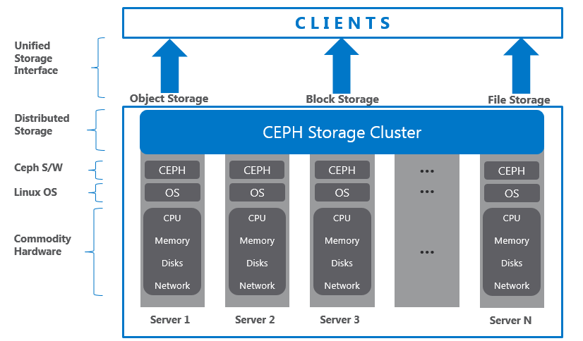
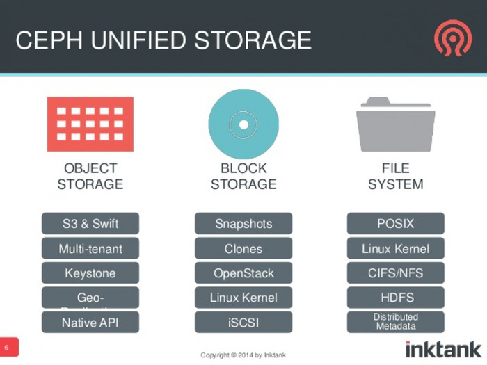

# CEPH Architecture

Nguyên tắc cơ bản của Ceph: 
- Khả năng mở rộng tất cả thành phần
- Khả năng chịu lỗi cao
- Giải pháp dựa trên phần mềm, hoàn toàn mở, tính thích nghi cao
- Chạy tương thích với mọi phần cứng
  
Ceph xây dựng kiến trúc mạnh mẽ, khả năng mở rộng không giới hạn, hiệu năng cao, cung cấp giải pháp thống nhất, nền tảng mạnh mẽ cho doanh nghiệp, giảm bớt sự phụ thuộc vào phần cứng đắt tiền. Hệ sinh thái Ceph cung cấp giải pháp lưu trữ dựa trên block, file, object, và cho phép tùy chỉnh theo ý muốn. Nền tảng Ceph xây dựng dựa trên các object, tổ chức trên các block. Tất cả các kiểu dữ liệu, block, file đều được lưu dưới dạng object, quản trị bởi Ceph cluster. Object storage hiện đã trở thành giải pháp cho hệ thống lưu trữ truyền thống, cho phép xây dựng kiến trúc hạ tầng độc lập với phần cứng.

Ceph xây dựng giải pháp dựa trên Object, Các object được tổ chức, nhân bản trên toàn cluster, nâng cao tính bảo đảm dữ liệu. Tại Ceph, Object sẽ không tồn tại đường dẫn vật lý, toàn bộ Object được quản trị dưới dạng Key Object, tạo nền tảng mở với khả năng lưu trữ tới hàng petabyte-exabyte.

## Ceph và tương lai của hệ thống lưu trữ

### Ceph – Giải pháp cloud storage

Thành phần quan trọng để phát triển Cloud chính là hạ tầng lưu trữ hay còn gọi là Storage. Cloud cần storage để phát triển, đáp ứng nhu cấp lưu trữ, tổ chức lượng dữ liệu cực lớn. Hiện nay, các giải pháp lưu trữ truyền thống đã dần tới giới hạn như gặp phải các vấn đề về chí phí, kiến trúc, tính mở rộng v.v. Ceph đã giải quyết được các vấn để đang gặp phải, đáp ứng nhu cầu lưu trữ của Cloud. Ceph hỗ trợ tốt các nền tảng Cloud nổi bật như OpenStack, CloudStack, OpenNebula. Đội ngũ phát triển và cộng tác của Ceph bao gồm các nhà cung cấp nền tảng lớn nhất (Canonical, Red Hat, SUSE), với nhiều năm kinh nghiệp cũng như nắm bắt được xu hướng phát triển, khiến Ceph luôn đi trước, bắt kịp thời đại, tương thích cao với Linux, thành một trong những hệ thống tốt nhất khi đánh giá xây dựng hạ tầng lưu trữ.

### Ceph – Giải pháp software-defined

Để tiết kiệm chi phí, Ceph xây dựng giải pháp dựa trên phần mềm Software-defined Storage (SDS). Cung cấp giải pháp đáp ứng các khách hàng đã có sẵn hạ tầng lớn, không mong muốn đầu tư thêm nhiều chi phí. SDS hỗ trợ tốt trên nhiều phấn cứng từ bất kỳ nhà cung cấp. Mang đến các lợi thế về giá thành, tính bảo đảm, và khả năng mở rộng.

### Ceph – Giải pháp lưu trữ thống nhất

Ceph mang đến giải pháp lưu trữ thống nhất bao gồm file-based và block-based access truy cập thống nhất qua nền tảng, giải pháp Ceph. Đáp ứng nhu cầu tăng trưởng dữ liệu hiện tại và cả trong tương lai. Ceph xây dựng giải pháp lưu trữ thống nhất (true unified storage solution) bao gồm object, block, file storage và đồng bộ qua nền tảng dựa trên phần mềm , hỗ trợ lưu trữ các luồng dữ liệu lớn, không có cấu trúc. Lợi dụng điểm mạnh của ceph, toàn bộ block hay file storage đều được lưu trữ dưới dạng đối tượng quản trị bởi Ceph Cluster. Ceph quản lý các object dưới kiến trúc riêng của mình. Object trong ceph được quản trị, tổ chức riêng biệt, và hỗ trợ mở rộng không giới hạn bằng cách lược bỏ các metadata, bỏ qua đường dẫn vật lý. Để làm được điều này, ceph sử dụng thuật toán động để tính toán, lưu trữ, tìm kiếm dữ liệu.

## Kiến trúc thế hệ mới

Vấn đề của các hệ thống lưu trữ truyền thống là không có phương pháp quản lý metadata thông minh. Cơ bản, các metadata là thông tin về dữ liệu, quyết định dữ liệu sẽ được lưu trữ, truy vấn, đọc ghi tại đâu. Các hệ thống lưu trữ truyền thống cần duy trì trung tâm quản lý metadata, chúng có trách nhiệm tìm kiếm thông tin về metadata. Vì vậy, mỗi khi client yêu cầu hoạt động đọc ghi, storage sẽ tìm kiếm vị trí dữ liệu trong các bảng metadata rất lớn. Với hệ thống nhỏ, độ trễ sẽ không lớn nhưng đối với các hệ thống lớn thì độ trễ sẽ rất cao, hạn chế khả năng mở rộng. Ceph không xây dựng giải pháp theo phương pháp truyền thống, nó sử dụng phát triển kiến trúc hoàn toàn mới, sử dụng phương pháp lưu trữ, tổ chức theo thuật toán động “CRUSH algorithm”. CRUSH viết tắt “Controlled Replication Under Scalable Hashing”. Thay vì tìm kiếm metadata theo bảng, thuật toán CRUSH sẽ dựa trên yêu cầu, tính toán vị trí dữ liệu, cải thiện tốc độ. Hơn thế, thuật toán được xử lý phân tán trên các cluster node, tận dụng sức mạnh tính toán phân tán (tính toán lưới). CRUSH quản lý các metadata tối ưu hơn rất nhiều khi so sánh với phương pháp truyền thống.

Bên cạnh đó, thuật toán CRUSH còn có khả năng nhận thức về hạ tầng. Hiểu được mối quan hệ giữa các thành phần trong hạ tầng như ổ đĩa hệ thống, các pool, các node, tủ rack, hệ thống điện, switch, các hàng máy chủ, các phòng máy chủ và còn hơn thế. Khi các thành phần xảy ra lỗi, CRUSH sẽ lưu trữ bản sao dữ liệu và nhân rộng chúng đến các phân vùng trong bộ nhớ, khiến dữ liệu luôn sẵn sàng, thống nhất. Đồng thời CRUSH cho phép cung cấp khả năng tự quản trị và tự sửa lỗi cho Ceph. Khi nhận thức lỗi, CRUSH sẽ tự sửa lỗi dữ liệu, tái phân bố dữ liệu trên toàn Cluster. Tại mọi thời điểm sẽ luôn có hơn một bản sao dữ liêu, nằm phân tán trong Cluster. Với CRUSH, Ceph tạo ra hạ tầng lưu trữ bảo đảm với độ tin cậy cao. Qua đó, Ceph đáp ứng các nhu cầu về mở rộng, đảm bảo hệ thống lưu trữ.

## Giới hạn của công nghệ Raid

Công nghệ Raid được ứng dụng cho Storage rất nhiều năm trở lại đây, 
nó là công nghệ thành công nhất trong lĩnh vực khôi phục, chịu lỗi, 
tái tạo dữ liệu. Tuy nhiên, công nghệ RAID hiện tại đã tới giới hạn. 
Thời điểm hiện tại, nó đã bắt đầu xuất hiện những điểm yếu rõ rệt 
khi ứng dụng vào những công nghệ mới. Công nghệ sản xuất ổ cứng ngày càng 
hiện đại với giá thành giảm dần. Dung lượng dữ liệu đã lên tới 4TB-6TB, 
và tăng dần theo từng năm. Với khối lượng dữ liệu càng lớn, việc tái tạo 
dữ liệu bằng RAID sẽ tốn rất nhiều thời gian, có thể mất tới vài tiếng 
đến vài ngày để sửa lỗi. Và nếu hỏng nhiều thiết bị cùng lúc, việc sửa lỗi sẽ tốn đến ngày, tháng để khôi phục, 
tốn rất nhiều chi phí. Hơn hết Raid sử dụng nhiều tài nguyên, tăng TCO, và khi storage đến giới hạn, nó sẽ lại đẩy chi phí đầu tư lên. 
Đồng thời khi đầu tư RAID, ta phải quan tâm đến các thông số ở đĩa, sẽ rất phức tạp khi cần nâng cấp. Việc sử dụng RAID cũng kéo theo các thiết bị phần cứng đắt tiền – RAID card. 
Chúng có thể phát sinh lỗi khi không thể lưu trữ thêm dữ liệu, bên cạnh đó là giới hạn phần cứng không thể thêm dung lượng kể cả khi đầu tư thêm chi phí. 
RAID tồn tại giới hạn về giải pháp: Raid 5 có thể chịu lỗi 1 ổ, Raid 6 2 ổ, nếu số ổ lỗi nhiều hơn, việc phục hồi dữ liệu sẽ trở nên rất khó khăn hoặc không thể khôi phục. 
Đồng thời, RAID chỉ có thể bảo vệ lỗi trên các ổ đĩa, còn các lỗi về mạng, phần cứng, hệ điều hành … chúng không thể giải quyết được. 
Ceph là giải pháp cho những vấn đề trên. Về tính đảm bảo, Ceph nhân bản dựa trên thuật toán, không phụ thuộc vào RAID. Ceph xây dựng giải pháp dựa trên phần mềm (software-defined storage), vì vậy ta sẽ không cần sử dụng các thiết bị chuyên dụng. 
Đồng thời Ceph nhân bản dữ liệu dựa trên cấu hình, vì thế người quản trị sẽ dễ dàng định nghĩa số lượng bản sao, tối ưu phần cứng, dễ dàng quản lý dữ liệu. Ceph còn có khả năng chịu lỗi nhiều hơn 2 ổ cứng với tốc độ khôi phục đáng ngạc nhiên (nhanh hơn rất rất nhiều khi so sánh với RAID). 
Đồng thời Ceph có thể lưu trữ khối lượng dữ liệu rất lớn dựa vào thuật toán CRUSH, và quản trị thông qua Cluster Map. Bên cạnh phương pháp nhân bản, Ceph cung cấp “erasure-coding technique”. Kỹ thuật này yêu cầu ít không gian lưu trữ hơn khi so sánh với replicated pool. 
Khi xử lý, dữ liệu sẽ được khôi phục và tái tạo bằng erasure-code calculation. Ta có thể sử dụng đồng thời 2 phương pháp trong giải pháp Ceph storage.

### Standard RAID levels

`RAID 0` bao gồm phân vùng dữ liệu ở cấp độ khối (block-level striping), nhưng không có sao lưu (mirroring) hay thông tin parity. So với một volume nối (spanned volume), dung lượng của một volume RAID 0 là tổng dung lượng của các ổ đĩa trong nhóm. Tuy nhiên, vì việc phân vùng dữ liệu phân tán các phần của mỗi tệp vào tất cả các ổ trong nhóm, khi một ổ đĩa bị hỏng, toàn bộ volume RAID 0 và tất cả các tệp sẽ bị mất. So với volume nối, các tệp trên những ổ đĩa không bị hỏng vẫn sẽ được bảo toàn. Lợi ích của RAID 0 là tốc độ đọc và ghi được nhân lên bởi số lượng ổ đĩa, vì khác với volume nối, các thao tác đọc và ghi được thực hiện đồng thời. Chi phí là tăng độ nhạy cảm với việc ổ cứng hỏng — vì bất kỳ ổ đĩa nào trong cấu hình RAID 0 bị hỏng sẽ làm mất toàn bộ volume, tỷ lệ hỏng ổ đĩa của volume sẽ tăng lên khi số lượng ổ đĩa trong nhóm tăng.

`RAID 1` bao gồm sao chép dữ liệu (mirroring), không có parity hay striping. Dữ liệu được sao chép giống hệt lên hai hoặc nhiều ổ, tạo thành một nhóm ổ "được sao chép". Vì vậy, bất kỳ yêu cầu đọc nào có thể được phục vụ bởi bất kỳ ổ đĩa nào trong nhóm. Nếu một yêu cầu được phát đến mọi ổ trong nhóm, nó có thể được phục vụ bởi ổ truy cập dữ liệu trước (tùy vào thời gian tìm kiếm và độ trễ quay), cải thiện hiệu suất. Tốc độ đọc bền vững, nếu bộ điều khiển hoặc phần mềm được tối ưu hóa cho điều này, sẽ tiếp cận tổng tốc độ của tất cả các ổ trong nhóm, giống như RAID 0. Tuy nhiên, tốc độ đọc thực tế của hầu hết các triển khai RAID 1 thường chậm hơn so với ổ nhanh nhất. Tốc độ ghi luôn chậm hơn vì mỗi ổ phải được cập nhật, và ổ chậm nhất sẽ giới hạn hiệu suất ghi. Mảng RAID 1 vẫn hoạt động miễn là ít nhất một ổ còn hoạt động.

`RAID 2` bao gồm phân vùng dữ liệu ở cấp độ bit với parity sử dụng mã Hamming. Tất cả các ổ đĩa đều quay đồng bộ và dữ liệu được phân vùng sao cho mỗi bit liên tiếp được lưu trữ trên một ổ đĩa khác nhau. Parity sử dụng mã Hamming được tính toán trên các bit tương ứng và lưu trữ trên ít nhất một ổ đĩa parity. RAID 2 chỉ có ý nghĩa lịch sử; mặc dù nó đã được sử dụng trên một số hệ thống máy tính đầu tiên (ví dụ, máy Thinking Machines CM-2), nhưng tính đến năm 2014, nó không còn được sử dụng trong các hệ thống thương mại.

`RAID 3` bao gồm phân vùng dữ liệu ở cấp độ byte với parity dành riêng. Tất cả các ổ đĩa đều quay đồng bộ và dữ liệu được phân vùng sao cho mỗi byte liên tiếp được lưu trữ trên một ổ đĩa khác nhau. Parity được tính toán trên các byte tương ứng và lưu trữ trên một ổ đĩa parity riêng biệt. Mặc dù có một số triển khai tồn tại, RAID 3 không được sử dụng phổ biến trong thực tế.

`RAID 4` bao gồm phân vùng dữ liệu ở cấp độ khối với parity dành riêng. Cấu hình này trước đây được sử dụng bởi NetApp, nhưng hiện nay đã bị thay thế chủ yếu bởi một triển khai riêng của RAID 4 với hai ổ đĩa parity, gọi là RAID-DP. Lợi thế chính của RAID 4 so với RAID 2 và 3 là tính song song I/O: trong RAID 2 và 3, một thao tác đọc I/O duy nhất yêu cầu phải đọc toàn bộ nhóm ổ dữ liệu, trong khi trong RAID 4, một thao tác đọc I/O không cần phải lan rộng trên tất cả các ổ đĩa dữ liệu. Kết quả là, có thể thực hiện nhiều thao tác I/O song song hơn, cải thiện hiệu suất của các truyền tải nhỏ.

`RAID 5` bao gồm phân vùng dữ liệu ở cấp độ khối với parity phân tán. Khác với RAID 4, thông tin parity được phân tán trên tất cả các ổ đĩa, yêu cầu tất cả các ổ đĩa ngoại trừ một ổ phải có mặt để hoạt động. Khi một ổ đĩa bị hỏng, các thao tác đọc sau đó có thể được tính toán từ thông tin parity phân tán để không mất dữ liệu. RAID 5 yêu cầu ít nhất ba ổ đĩa. Giống như tất cả các khái niệm parity đơn, các triển khai RAID 5 lớn dễ bị gặp vấn đề khi hệ thống gặp sự cố vì thời gian phục hồi mảng và khả năng ổ đĩa bị hỏng trong khi phục hồi. Việc phục hồi một mảng yêu cầu phải đọc tất cả dữ liệu từ tất cả các ổ đĩa, mở ra khả năng hỏng thêm một ổ đĩa nữa và mất toàn bộ mảng.

`RAID 6` bao gồm phân vùng dữ liệu ở cấp độ khối với parity phân tán kép. Parity kép cung cấp khả năng chịu lỗi với hai ổ đĩa bị hỏng. Điều này làm cho các nhóm RAID lớn hơn trở nên thực tế hơn, đặc biệt đối với các hệ thống có tính sẵn sàng cao, vì các ổ đĩa có dung lượng lớn cần nhiều thời gian để phục hồi. RAID 6 yêu cầu ít nhất bốn ổ đĩa. Giống như RAID 5, việc một ổ đĩa bị hỏng dẫn đến hiệu suất của toàn bộ mảng bị giảm cho đến khi ổ đĩa bị hỏng được thay thế. Với mảng RAID 6, việc sử dụng ổ đĩa từ nhiều nguồn và nhà sản xuất khác nhau có thể giảm thiểu hầu hết các vấn đề liên quan đến RAID 5. Càng lớn dung lượng ổ đĩa và kích thước mảng, càng quan trọng khi chọn RAID 6 thay vì RAID 5. RAID 10 cũng giúp giảm thiểu những vấn đề này.

### Nested (hybrid) RAID

Trong mô hình RAID lai (hybrid RAID), các bộ điều khiển lưu trữ cho phép lồng các mức RAID lại với nhau. Các phần tử của một mảng RAID (RAID array) có thể là ổ đĩa riêng lẻ hoặc các mảng RAID khác. Thông thường, các mảng RAID hiếm khi được lồng sâu hơn một cấp độ.

Mảng cuối cùng được gọi là mảng trên cùng (top array). Khi mảng trên cùng là RAID 0 (như trong RAID 1+0 và RAID 5+0), hầu hết các nhà cung cấp sẽ lược bỏ ký hiệu "+" (cho ra RAID 10 và RAID 50 tương ứng).

Các loại RAID lồng ghép phổ biến:

- `RAID 0+1`: Tạo hai mảng striping và thực hiện việc mirror chúng. 
  - Nếu một ổ đĩa gặp lỗi, một trong hai mirror sẽ thất bại, khiến hệ thống hoạt động như RAID 0, không còn khả năng dự phòng.
  - Rủi ro tăng lên đáng kể trong quá trình phục hồi (rebuild), vì tất cả dữ liệu từ các ổ đĩa còn lại trong mảng striping cần được đọc. Điều này làm tăng khả năng xảy ra lỗi đọc không thể phục hồi (URE) và kéo dài thời gian phục hồi.
- `RAID 1+0` (hay RAID 10): Tạo một mảng striping từ các ổ đĩa được mirror.
  - Mảng có thể chịu được mất nhiều ổ đĩa, miễn là không có mirror nào mất toàn bộ ổ đĩa của nó.
- `JBOD RAID N+N`: Với JBOD (just a bunch of disks - chỉ là một nhóm ổ đĩa), người dùng có thể nối các ổ đĩa hoặc các volume như các mảng RAID.
  - Với dung lượng ổ đĩa lớn hơn, thời gian ghi dữ liệu và phục hồi sẽ tăng đáng kể (đặc biệt với RAID 5 và RAID 6).
  - Bằng cách chia một mảng RAID N lớn thành các tập con nhỏ hơn và ghép nối chúng theo kiểu tuyến tính bằng JBOD, thời gian ghi và phục hồi sẽ được giảm.
  - Nếu bộ điều khiển RAID phần cứng không hỗ trợ lồng ghép JBOD tuyến tính với RAID N, người dùng có thể đạt được JBOD tuyến tính bằng RAID phần mềm cấp hệ điều hành (OS-level RAID) kết hợp với các volume RAID N riêng biệt.

  - Ưu điểm:

    - Tăng đáng kể tốc độ.
    - Cho phép khởi đầu với một tập nhỏ ổ đĩa và mở rộng tập ổ đĩa bằng các ổ có kích thước khác nhau (phù hợp với sự xuất hiện của các ổ đĩa dung lượng lớn hơn trên thị trường).
    - Tăng khả năng khôi phục dữ liệu (nếu một tập RAID N bị lỗi, dữ liệu trên các tập RAID N khác không bị mất, giảm thời gian phục hồi).

## RAID Controller

RAID Controller là một thiết bị phần cứng hoặc chương trình phần mềm được sử dụng để quản lý các ổ đĩa cứng (HDD) hoặc SSD trong máy tính hoặc hệ thống lưu trữ, giúp chúng hoạt động như một đơn vị logic (logical unit).

RAID Controller cung cấp một mức độ bảo vệ cho dữ liệu được lưu trữ và có thể giúp cải thiện hiệu suất máy tính bằng cách tăng tốc truy cập dữ liệu được lưu trữ.

### RAID Controller Does

RAID controller cung cấp một mức độ abstraction giữa hệ điều hành (OS) và các ổ đĩa vật lý. Nó present các nhóm hoặc các phần của ổ đĩa dưới dạng các đơn vị logic tới ứng dụng và hệ điều hành, nơi có thể định nghĩa các cơ chế bảo vệ dữ liệu. Các đơn vị logic này xuất hiện như những ổ đĩa (hoặc các phần của ổ đĩa) đối với ứng dụng và hệ điều hành, mặc dù chúng thực chất có thể bao gồm nhiều phần của nhiều ổ đĩa khác nhau.

Vì RAID controller có khả năng truy cập nhiều bản sao dữ liệu trên nhiều thiết bị vật lý, nó có thể cải thiện hiệu suất và bảo vệ dữ liệu trong trường hợp hệ thống bị sự cố.

### Hardware RAID controllers

Trong RAID dựa trên phần cứng, một bộ điều khiển vật lý được sử dụng để quản lý mảng RAID. Bộ điều khiển này có thể là một thẻ PCI hoặc PCI Express (PCIe), được thiết kế để hỗ trợ một định dạng ổ đĩa cụ thể, chẳng hạn như Serial Advanced Technology Attachment (SATA) hoặc Small Computer System Interface (SCSI). Một số RAID controller cũng có thể được tích hợp trực tiếp vào bo mạch chủ.

RAID controller dựa trên phần cứng thường được gọi là RAID adapter.

### Software RAID controllers

Bộ điều khiển RAID cũng có thể chỉ dựa trên phần mềm, sử dụng tài nguyên phần cứng của hệ thống chủ, đặc biệt là bộ xử lý trung tâm (CPU) và RAM động (DRAM) của hệ thống chủ. RAID dựa trên phần mềm thường cung cấp chức năng tương tự như RAID dựa trên phần cứng, nhưng hiệu suất thường kém hơn so với các phiên bản phần cứng.

Ưu điểm của RAID dựa trên phần mềm

- Tính linh hoạt và chi phí thấp, vì không cần phần cứng đặc biệt.
- Tuy nhiên, cần đảm bảo rằng bộ xử lý của hệ thống chủ đủ mạnh để chạy phần mềm RAID mà không làm ảnh hưởng đến hiệu suất của các ứng dụng khác chạy trên hệ thống.

## How RAID handles hard drive failure ?

- RAID 0 (Striping - Phân mảnh dữ liệu)
  - Không có khả năng chịu lỗi: Khi một ổ cứng bị hỏng, toàn bộ dữ liệu trong hệ thống RAID bị mất.
  - RAID 0 không cung cấp tính năng phục hồi vì không có sao lưu hoặc thông tin chẵn lẻ (parity).

- RAID 1 (Mirroring - Dữ liệu nhân bản)
  - Khả năng chịu lỗi cao: Dữ liệu được nhân bản trên ít nhất 2 ổ cứng.
  - Khi một ổ cứng hỏng, RAID 1 tiếp tục hoạt động bằng cách sử dụng ổ cứng còn lại chứa dữ liệu sao chép.
  - Quá trình thay thế ổ cứng hỏng:
    - Người quản trị thay ổ đĩa hỏng bằng ổ mới.
    - RAID tự động sao chép dữ liệu từ ổ cứng còn lại sang ổ mới.
- RAID 5 (Striping with Distributed Parity - Phân mảnh và phân bố chẵn lẻ)
  - Chịu lỗi 1 ổ cứng:
    - Nếu 1 ổ cứng hỏng, hệ thống sử dụng thông tin chẵn lẻ để tái tạo dữ liệu từ ổ hỏng.
    - Trong lúc đó, hiệu suất đọc/ghi sẽ giảm vì phải tái tạo dữ liệu mỗi lần truy cập.
  - Quá trình phục hồi:
    - Thay ổ cứng hỏng bằng ổ mới.
    - RAID sẽ tự động xây dựng lại dữ liệu trên ổ mới bằng cách sử dụng thông tin chẵn lẻ từ các ổ còn lại.
  
- RAID 6 (Double Parity - Chẵn lẻ kép)
  - Chịu lỗi 2 ổ cứng đồng thời: RAID 6 sử dụng 2 khối chẵn lẻ, cho phép hệ thống tiếp tục hoạt động ngay cả khi 2 ổ cứng hỏng.
  - Quá trình phục hồi:
    - Tương tự RAID 5, nhưng việc tái tạo dữ liệu chậm hơn do cần xử lý thông tin từ 2 khối chẵn lẻ.

- RAID 10 (RAID 1+0 - Mirrored Striping)
  - Khả năng chịu lỗi tốt hơn RAID 0+1:
    - Hệ thống tiếp tục hoạt động miễn là mỗi nhóm mirror (RAID 1) còn ít nhất 1 ổ cứng.
  - Quá trình phục hồi:
    - Thay ổ cứng hỏng.
    - RAID tự động sao chép dữ liệu từ ổ mirror sang ổ mới.

