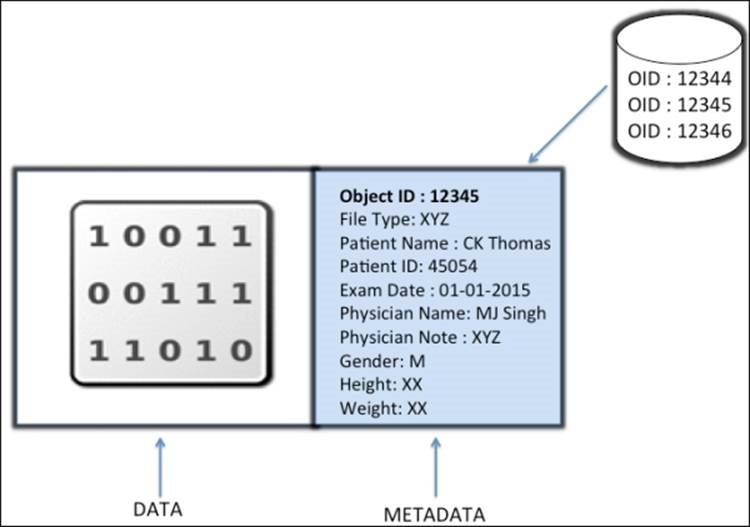
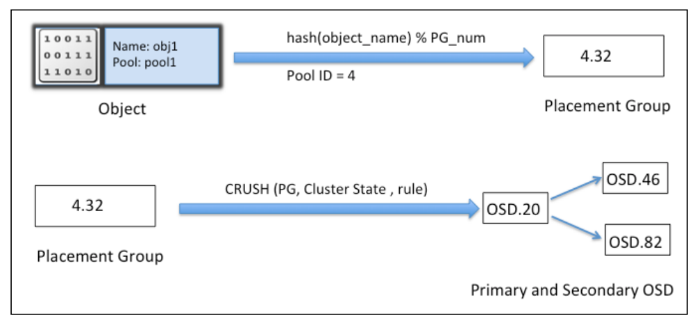
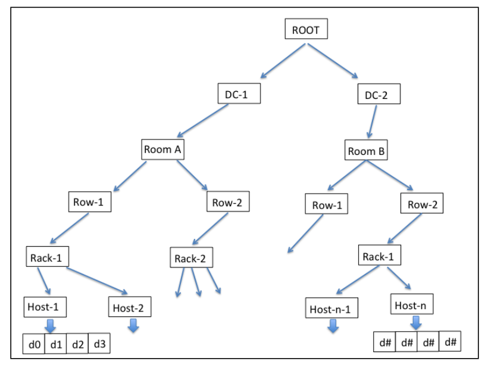
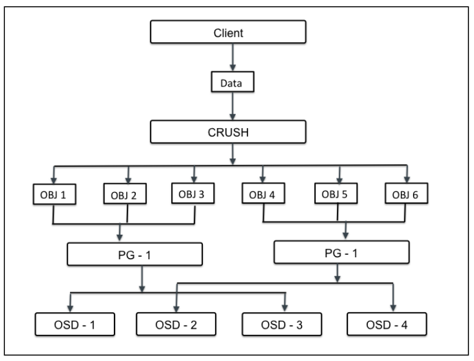

# CRUSH: Controlled, Scalable, Decentralized Placement of Replicated Data

Các Ceph Client và Ceph OSD Daemon đều sử dụng thuật toán CRUSH để tính toán thông tin về vị trí đối tượng thay vì dựa vào một bảng tra cứu tập trung (central lookup table). CRUSH cung cấp một cơ chế quản lý dữ liệu tốt hơn so với các phương pháp cũ, và cho phép mở rộng quy mô lớn bằng cách phân phối công việc cho tất cả các OSD Daemon trong cụm và các máy khách giao tiếp với chúng. CRUSH sử dụng sao chép dữ liệu thông minh để đảm bảo khả năng chịu lỗi, điều này phù hợp hơn với lưu trữ ở quy mô siêu lớn.

## CEPH Internal

Kỹ thuật lưu trữ truyền thống sau khi lưu trữ dữ liệu sẽ sử dụng các metadata để quản trị. Metadata là các thông tin liên quan đến dữ liệu, định danh về nơi dữ liệu được lưu thực tế.

## Object 

Object bao gồm thành phần dữ liệu và các metadata liên quan, 1 thuộc tính định danh (globally unique identifier) đối tượng. Định danh riêng bảo đảm object sẽ độc nhất trong storage cluster. Khác file-based storage bị gói hạn size. Object có thể có size to và có thể thay đổi metadata. Dữ liệu được lưu với nhiều metadata, các thông tin này mô tả dữ liệu lưu trữ. Metadata trong object storage cho phép user quản lý và truy cập dữ liệu không có cấu trúc.



Ceph không tổ chức dữ liệu dạng cây phân cấp, object được lưu trong không gian địa chỉ với hàng ngàn object, theo quy tắc tổ chức rõ ràng. Object có thể được lưu trữ cục bộ, hoặc lưu tách biệt với mặt vật lý trong không gian lưu trữ liền kề (flat-address space). Kỹ thuật CRUSH cho phép object có định danh độc nhất trên toàn cluster, ứng dụng có thể lấy dữ liệu từ object dựa trên OID (sử dụng RESTful API calls). Object được lưu trong Object-based Storage Device (OSDs), theo phương pháp nhân bản bản, cung cấp tính HA. Khi Ceph storage cluster nhận yêu cầu đọc ghi từ client, nó lưu dữ liệu dưới dạng object. Tiến trình OSD ghi dữ liệu tới file trong OSD file system.

### Định vị Object

- Mỗi đơn vị dữ liệu trong Ceph được lưu dưới dạng object trong không gian lưu trữ Ceph.
- Ceph pool là logical partition sử dụng lưu trữ object, cung cấp phương pháp tổ chức storage.
- Object là đơn vị nhỏ nhất trong data storage tại Ceph. Khi Ceph cluster được triển khai, nó tạo một số storage pool mặc định như data, metadata, and RBD pools.
- Sau khi MDS triển khai trên 1 Ceph node, nó tạo object trong metadata pool, đồng thời yêu cầu CephFS để cung cấp tính năng đi kèm.

## CRUSH Algorithm

### Vấn đề

Kỹ thuật lưu trữ truyền thống sau khi lưu trữ dữ liệu sẽ sử dụng các metadata để quản trị. Metadata là các thông tin liên quan đến dữ liệu, định danh về nơi dữ liệu được lưu thực tế (series of storage nodes and disk arrays). Mỗi thời điểm dữ liệu được thêm mới vào Storage System, metadata sẽ được cập nhật thông tin (vị trí, size, v.v). Phương thức này sử dụng tốt khi lưu trữ số lượng nhỏ (vài TB -> vài trăm TB) nhưng khi dữ liệu lên tới EB, phương pháp này sẽ xuất hiện nhiều hạn chế. Tính chịu lỗi đơn thấp (mất metadata sẽ dẫn tới mất toàn bộ dữ liệu), giải quyết bằng phương pháp tạo những bản sao, lưu tại các vị trí khác nhau tăng tính chịu lỗi nhưng phương pháp này rất phức tạp, chứa nhiều vấn đề về Storage system’s scalability, high availability, performance. Ceph đã thực sự giải quyết được các vấn đề storage truyền thống đang gặp phải. Giải pháp xây dựng dựa trên thuật toán Crush, phân phối dữ liệu thông minh qua Ceph. Thuật toán CRUSH là thành phần khiến Ceph trở nên nổi bật, nó giúp Ceph tính toán quyết định vị trí lưu trữ. Thay vì lưu trữ, quản trị metadata phức tạp, CRUSH tính toán metadata theo yêu cầu, loại bỏ các điểm yếu khi sử dụng metadata theo cách truyền thống.

### CRUSH lookup

Với CRUSH, luồng tính toán metadata sẽ được phân phối và thực hiện khi cần thiết. Tiến trình tính toán Metadata được gọi là CRUSH Lookup, với kỹ thuật này được xây dựng dựa trên tính toán lưới cho phép hoạt động CRUSH Lookup diễn ra nhanh chóng với hiệu năng cao. Điểm đặc biệt cho CRUSH Lookup là không phụ thuộc vào hệ thống. Ceph cung cấp tính linh hoạt cho client khi thực hiện tính toán vị trí metadata với tài nguyên của chính client, giảm công việc tại trung tâm Ceph. Với các hoạt động tại Ceph cluster, client tương tác với Ceph monitor nhận lại cluster map. Cluster map giúp client biết trạng thái cấu hình Ceph cluster. Dữ liệu được chuyển thành object với object cùng pool name/IDs. Object sẽ được tính toán số vị trí group để sinh ra giá trị cuối cùng mà không yêu cầu từ Ceph pool. Tính toán vị trí group thông qua CRUSH lookup để quyết định vị trí primary OSD được lưu và lấy lại. Sau tính toán, chiết xuất OSD ID, client liên hệ với OSD trực tiếp, đọc ghi dữ liệu data. Tất các tính toán thực hiện bởi client, do đó nó không ảnh hưởng tới hiệu năng cluster. Khi dữ liệu được ghi tới primary OSD, node tương tự thực hiện tiến trình CRUSH lookup, tính toán vị trí secondary placement groups (vị trí phụ thứ yếu) trong OSD, vì thế dữ liệu được nhân bản khắp Cluster đáp ứng tính HA. Quá trình tính toán diễn ra như sau: 

- Đầu tiên, Object name và cluster placement group number được thêm với hash function và dựa trên pool IDs; vị trí group ID, PGID được tính ra. 
- Tiếp theo Crush lookup thực hiện trên PGID để tìm primary và secondary OSD để ghi data.



### CRUSH Hierarchy

Thuật toán CRUSH có khả năng nhận thức hạ tầng, và hoàn toàn do user cấu hình. Nó duy trì phân cấp lồng nhau (nested hierarchy) cho tất cả thành phần của hạ tầng. CRUSH device list thường là disk, node, rack, row, switch, power circuit, room, data center, v.v. Các thành phần được biết tới như là failure zones hoặc CRUSH buckets. CRUSH map chứa danh sách các bucket có sẵn tập hợp các thiết bị trong các vị trí vật lý. Đồng thời chứa danh sách các rule cho phép CRUSH tính toán nhân bản dữ liệu trên các Ceph pool khác nhau.



Dựa trên hạ tầng, CRUSH sẽ lưu trữ, nhân bản dữ liệu trên khắp khu vực chịu lỗi (failure zones) khiến dữ liệu an toàn, kể cả khi một số thành phần lỗi. Đây là cách CRUSH loại bỏ các thành phần có khả năng xảy ra lỗi trên hạ tầng lưu trữ, đồng thời nó sử dụng các thiết bị thông thường mà vẫn đảm bảo tính HA (không phải thiết bị chuyên dụng). CRUSH ghi dữ liệu công bằng trên khắp cluster disk, tăng hiệu năng, tính bảo đảm, đưa dữ liệu đến tất cả ổ đĩa vào cluster. Nó chắc rằng tất cả Cluster Disk được sử dụng bằng nhau kể cả khả năng lưu trữ khác nhau. Để làm được điều đó, CRUSH cấp phát thuộc tính “weight” trên mỗi OSD. Chỉ số weight càng cao trên OSD thì khả năng lưu trữ của OSD càng cao, từ đó CRUSH sẽ ghi nhiều dữ liệu hơn tới những OSD này, duy trì tính cân bằng trên các thiết bị.

### Khôi phục, tái cân bằng

Trong trường hợp xảy ra lỗi trên bất kỳ thành phần nào trong failure zone, Ceph sẽ chờ 300s theo mặc định trước khi nó đánh dấu OSD down và thực hiện quá trình khôi phục. Tùy chỉnh tham số này bằng trường “mon osd down out interval” tại file cấu hình của Ceph cluster. Trong quá trình khôi phục, Ceph sẽ khôi phục lại các dữ liệu bị ảnh hưởng trên node lỗi. Vì CRUSH nhân bản dữ liệu trên nhiều ổ đĩa, các phiên bản của dữ liệu sẽ được sử dụng cho quá trình khôi phục. CRUSH cố gắng di chuyển các dữ liệu ít nhất trong quá trình khôi phục, thiết kế lại cluster layout, khiến cho dù Ceph chịu lỗi vẫn có thể hoạt động bình thường. Khi host mới hoặc disk được thêm vào Ceph cluster, CRUSH bắt đầu quá trình tái cần bằng - di chuyển dữ liệu từ host/disk có sẵn tới new host/disk. Quá trình tái cần bằng giữ tất cả disk cân bằng, nâng cao hiệu năng cluster, giữ khả năng đáp ứng cao. Ví dụ như, Ceph cluster chứa 2000 OSDs, thêm mới 1 hệ thống với 20 OSDs mới thì chỉ số phần tra dữ liệu đã sử dụng trong các OSD cũ sẽ được tái cân bằng, tất cả các OSD vẫn hoạt động song song quá trình tái cần bằng, giữ các hoạt động diễn ra bình thường. Tuy nhiên Ceph cluster được sử dụng nhiều trong thời điểm này, vì vậy khuyên cáo OSD mới nên cấu hình với weight 0 và dần dần tăng weight tới giá trị cao hơn, từ đó, quá trình tái cân bằng diễn ra ngắn hơn, tránh làm giảm hiệu năng.

### Nhóm chỉ định - Placement groups

Khi Ceph cluster nhận yêu cầu từ data storage, nó sẽ chia object vào các nhóm, chúng được là placement groups (PG). CRUSH sẽ tổ chức dữ liệu thành tập các Object, dựa trên hoạt động hash và id object, mức nhân bản, các PGs (placement groups) trong hệ thông sẽ có các PGs ID tương ứng. Placement groups được coi là tập logical (logical collection) các object được nhân bản trên các OSD, qua đó nâng cao tính bảo đảm dữ liệu tại Storage System. Dựa trên mức replicate của Ceph pool, placement group sẽ được nhân bản, phân tán trên nhiều hơn 1 OSD tại Ceph cluster. Ta có thể cân nhắc placement group như logical container chứa các object. PGs (vị trí nhóm) được thiết kế đáp ứng khả năng mở rộng, hiệu suất cao trong Ceph Storage System, đồng thời hỗ trợ việc quản trị Object.

Khi administrator tạo 1 pool, CRUSH sẽ tạo ra các PGs cho pool đó (số lượng do user defined). Số lượng PGs nên hợp lý với số lượng của OSDs. Ví dụ, ta có 1 pool và trong đó chỉ có 1 OSDs, nếu ta chia thành 100PGs thì nghĩa là mỗi PGs chữa khoảng xấp xỉ 1% dữ liệu của toàn bộ pool đó. Số lượng của PGs sẽ ảnh hưởng tới hiệu suất của CEPH khi cần di chuyển PG từ OSD này sang OSD khác. Nếu pool có quá ít PGs, Ceph sẽ phải di chuyển 1 lượng dữ liệu lớn mỗi lần di chuyển 1 PG → ảnh hưởng đến network → giảm hiệu suất của cluster. Nếu pool quá nhiều PGs, Ceph sẽ phải sử dụng nhiều CPU và RAM chỉ để di chuyển 1 lượng nhỏ dữ liệu → ít hiệu quả hơn → giảm hiệu suất của cluster.

Ceph sẽ đảm bảo sự mất mát dữ liệu bằng lưu trữ các replicas của object hoặc erasure code chunks của object. Do đó, danh sách tập hợp các OSDs của PGs để lưu trữ từng replicas hoặc từng erasure code chunks gọi là `Acting Set`. Administrator ngoài việc xác định được số lượng PGs trong 1 pool thì cũng có thể chỉ rõ số lượng replicas hoặc số lượng erasure code chunks. Còn việc cho OSDs ở trong `Acting Set` của PGs nào sẽ do thuật toán CRUSH xử lý.

Sự kết hợp giữa thuật toán CRUSH và PGs mang lại khả năng linh hoạt cho Ceph. Chỉ cần có thay đổi trong cluster map hay cluster state có thể làm cho Ceph di chuyển PGs từ OSD này sang OSD khác 1 cách tự động. Ta sẽ thấy rõ hơn ở 1 vài ví dụ dưới đây:

- Expanding the Cluster - Mở rộng cluster: Khi thêm 1 host mới và các OSDs của nó vào cluster thì sẽ làm cho cluster map thay đổi. Vì CRUSH phân phối đều PGs và `pseudo-randomly` PGs vào OSD, nên khi thêm thì CRUSH sẽ gán lại 1 vài PGs vào OSD mới. Administrators sẽ không cần cân bằng cluster 1 cách thủ công. Ngoài ra, CRUSH cũng sẽ cho các OSDs mới cũng chứa xấp xỉ 1 lượng dữ liệu giống như các OSDs khác. Điều này ngăn việc OSDs mới trống quá nhiều → dễ trở thành điểm nóng khi ghi trong cluster.
- An OSD Fails: Khi 1 OSD fail sẽ làm cho `state of the cluster` bị thay đổi. Ceph sẽ tạm thời mất 1 bản replicas hoặc 1 erasure code chunks và cần phải tạo 1 bản. Nếu primary OSD trong `Acting set` bị fail thì OSD tiếp theo trong `Acting set` trở thành primary và CRUSH sẽ tính toán ra OSD mới để lưu trữ bổ sung 1 bản replicas hoặc 1 erasure code chunks.

Bằng cách quản lý hàng triệu đối tượng thông qua hàng trăm cho tới hàng nghìn PGs, Ceph storage cluster có thể dễ dàng mở rộng, thu nhỏ hoặc phục hồi lại khi bị lỗi 1 cách hiệu quả.
Đối với Ceph Clients, sử dụng thuật toán CRUSH thông qua `librados` API khiến việc đọc ghi object rất đơn giản. Nó chỉ cần đọc hoặc ghi 1 object từ pool. Primary OSD trong acting set có thể ghi replicas hay erasure code chunks của object đó thay cho Ceph client vào secondary OSD. Như đã nói ở trên, cluster map hay cluster state thay đổi thì CRUSH sẽ tính toán để những OSDs của PG cũng thay đổi theo. Ví dụ, khi Client ghi object `fool` vào pool `bar`. CRUSH sẽ gán object vào PG `1.a` → lưu nó trong OSD `5` và các bản sao ở OSD `10`, `15` tương ứng. Nếu OSD `5` fail, cluster state thay đổi. Khi Client yêu cầu đọc object `fool` từ pool `bar`, `librados` sẽ tự động đọc dữ liệu từ OSD `10` như primary OSD mới.

Ceph Client thông qua `librados`, kết nối trực tiếp với primary OSD ở trong acting set để đọc ghi đối tượng. Vì các hoạt động I/O phi tập trung, nên network oversubscription không phải là vấn đề với Ceph.

Sơ đồ mô tả cách CRUSH gán các object vào PGS và gán PGs sang OSDs. Thuật toán CRUSH gán PGs cho OSDs sao cho mỗi OSD trong acting set nằm trong một failure domain riêng biệt, thường có nghĩa là OSDS sẽ luôn ở trên host riêng biệt và đôi khi trong các racks riêng biệt.




Nếu không có các PGs, việc quản trị dữ liệu sẽ trở nên rất khó, cùng với đó là khả tổ chức các object đã được nhân bản (hảng triệu object) tới hàng trăm các OSD khác nhau. Qua đó, thay vì quản trị object riêng biệt, hệ thông sẽ sử dụng PGs (chứ số lượng rất nhiều object). PGs sẽ khiến ceph dễ quản trị dữ liệu và giảm bớt sự phức tạp trong khâu quản lý. Mỗi PG sẽ yêu cầu tài nguyên hệ thống nhất định (CPU và Memory, v.v vì chúng quản lý rất nhiều object). Số lượng PGs trong cluster cần được tính toán tỉ mỉ. Thông thường, tăng số lượng PGs trong cluster sẽ giảm bớt gánh nặng trên mỗi OSD, nhưng cần xem xét theo quy chuẩn. Khuyến nghị 50-100 PGs trên mỗi OSD. Nó tránh tiêu tốn quá nhiều tài nguyên trên mỗi OSD node, giảm gánh nặng OSD. Khi dữ liệu tăng, ta cần mở rộng cluster cùng với điều chỉnh số lượng PGs. Khi thiếtt bị mới được thêm, xóa bỏ khói cluster, các PGs sẽ vẫn tồn tại – CRUSH sẽ quản lý việc tài cấp phát PGs trên toàn cluster.

```
Giá trị PGP là tổng số PGs sử dụng cho mục đích tổ chức dữ liệu, giá trị này cần bằng PGs
```

#### Tính toán số PG cần thiết

Xác định số PGs là bước cần thiết khi xây dựng hạ tầng Ceph storage cluster cho doanh nghiệp. PGs sẽ quyết đinh hiệu năng storge. Công thức tính tổng placement group cho Ceph cluster:

```
Total PGs = (Total_number_of_OSD * 100) / max_replication_count

Kết quả có thể làm tròn gần nhất theo 2 ^ đơn vị.
```

```
Ví dụ:
10 OSD Cluster bao gồm 10 OSD, 512 PGs, 3 repica pool

CRUSH sẽ phân tích mỗi PGs 3 OSD
Sau khi phân chia xong, mỗi OSD sẽ chứa (512*3)/10 = 150 PGs => Khi 1 OSD lỗi, kịch bản sẽ khôi phục 150 PGs trên cùng 1 thời điểm => 150 PGs còn lại sẽ nằm trên 9 OSD còn lại.

VD: Cluster có 10->20 OSDs với 512 PGs, mức nhân bản 3

CRUSH gán mỗi PG 3 OSDs
Kết thúc, (512*3)/20 = (150 -> 75) PGs
Mỗi 1 OSD lỗi => 19 OSD sẽ backup lại dữ liêu => OSD lỗi = 1 TB => 10 OSD giữa 100GB (đủ 1 TB OSD lỗi) => càng nhiều OSD tốc độ backup càng cao.

VD: Cluster 40 OSD, 512 PGs, 3 repical pool

Crush gán 3 OSD mỗi PG
Sau tính toán, mỗi OSD chứa (512*3)/40 = 35 - 40 PGs => 1 OSD lỗi (1TB data) => 39 OSD còn lại sẽ backup => Dung lượng Backup mỗi OSD = 1000 / 39 ~ 25 GB mỗi OSD => Quá trình backup diễn ra càng nhanh khi có nhiều OSD

VD: 200 OSD, 512 PGs, 3 repi pool

CRUSH gán mỗi PG 3 OSD
Sau tính toán, mỗi OSD chứa 7 PGs
Khi 1 OSD lỗi, 7*3 OSD sẽ diễn ra hoạt động backup => Dung lượng backup trên 21 OSD = 1000/21 ~~ 47 GB (nhanh hơn so với 10 PG)
```

### Ceph pool

Ceph pool cung cấp khả năng quản lý storage với pool. Ceph pool là logical partition để lưu các object. Mỗi pool trong Ceph lưu một số lượng nhất định PGs, quản trị object và được map tới các OSD trên khắp cluster. Vì thế mỗi single pool được phân phối khắp cluster node. Quản trị dữ liệu trong Ceph Dữ liệu bên trong cluster được quản trị dựa trên rất nhiều thành phần. Sự kết hợp các thành phần mang đến cho Ceph tính bảo đảm, tin cậy, mạnh mẽ. Quá trình quản trị dữ liệu bắt đầu từ khi client ghi dữ liệu xuống Ceph pool. Dữ liệu đầu tiên sẽ ghi tới primary OSD sau đó tới các OSD thứ cấp theo cấu hình mức nhân bản tùy chỉnh.


Ceph storage systems cung cấp cho ta 1 khái niệm Pool, là 1 phân vùng logic để lưu trữ các object. Các Ceph administrators có thể tạo các pool cho từng loại dữ liệu cụ thể; ví dụ như chia ra các pool theo từng mục đích khác nhau.

Ceph pools sẽ xác định các parameters sau:

- Pool Type: Để đảm bảo tính bền vững của dữ liệu Ceph có thể sử dụng 1 trong 2 phương thức: duy trì các replicas của object hoặc `erasure coding`. Các phương thức này được sử dụng trên pool đã được config (2 pool khác nhau có thể dùng 2 phương thức khác nhau) và không thể thay đổi khi đã tạo pool. Pool type sẽ xác định phương thức ta sử dụng. Pool type hoàn toàn `transparent` với Ceph Client.
- Placement Groups: Trong các storage cluster quy mô lớn, Ceph pool có thể phải lưu trữ hàng triệu objects hoặc nhiều hơn. Ceph sẽ phải xử lý rất nhiều hoạt động như đảm bảo tính bền vững dữ liệu (bằng 1 trong 2 phương thức: replicas hoặc erasure code chunks tuỳ thuộc Pool Type), tính toàn vẹn dữ liệu (bằng các phương thức scrubbing, CRC checks, replication, rebalancing và recovery). Do đó, việc quản lý dữ liệu trên từng đối tượng có thể giảm khả năng mở rộng và gây ra tình trạng nghẽn cổ chai. Ceph giải quyết vấn đề bằng cách chia pool vào các placement groups. Thuật toán CRUSH sẽ tính toán placement groups cho việc lưu trữ dữ liệu và cũng tính Acting Set của OSDs cho placement group. CRUSH sẽ đặt mỗi object vào 1 placement group. Sau đó CRUSH lưu trữ mỗi placement group trong 1 tập hợp OSDs.
- CRUSH Ruleset: CRUSH cũng đóng 1 vai trò quan trọng khác: CRUSH có thể xác định failure domains và performance domains bằng cách định nghĩa, tổ chức OSDs theo thứ bậc thành osds, nodes, rack hoặc row v.v (failure domains). Để xác định được failure domains và performance domains, Administrators chỉ cần config CRUSH ruleset khi tạo pool và tất nhiên, cũng không thể thay đổi được sau khi pool đã tạo.
- Durability: Trong các storage cluster quy mô lớn, hardware failure là 1 điều bình thường, không phải là exception. Vì ta chia dữ liệu thành các object để lưu trữ nên khi mất 1 hoặc nhiều object thì nó sẽ gây ảnh hướng tới dữ liệu khi được hợp lại và khiến nó lỗi, ảnh hưởng khá nghiêm trọng. Do đó, để đảm bào tính bền vững của dữ liệu Ceph cung cấp cho ta 2 phương thức:
  - Replica pools (Pool có type là replica) sử dụng CRUSH failure domains để lưu trữ các replicas của object sang các tổ chức thứ bậc vật lý khác (ví dụ các osds khác, nodes khác, rack khác v.v). Điều này sẽ đảm bảo nếu hardware failure xảy ra.
  -  Erasure coded pools (Pool có type là erasure coding) lưu trữ mỗi object dưới dạng K+M chunks. Trong đó, K thể hiện số lượng data chunk còn M là số lượng coding chunks. Ngoài ra, tổng của chúng cũng thể hiện tổng số lượng OSDs dùng để lưu trữ object, M cũng cho biết số lượng OSDs tối đa có thể lỗi mà vẫn khôi phục lại được object. Từ góc nhìn của Ceph Clients, storage cluster trông khá là đơn giản. Nó chỉ cần lấy bản sao Cluster Map từ Ceph Monitor, sau đó ghi và đọc object vào pools. Tuy nhiên từ những điều trên, Pools đóng vai trò quan trọng trong việc cách Ceph storage cluster phân phối và lưu trữ dữ liệu.
 


