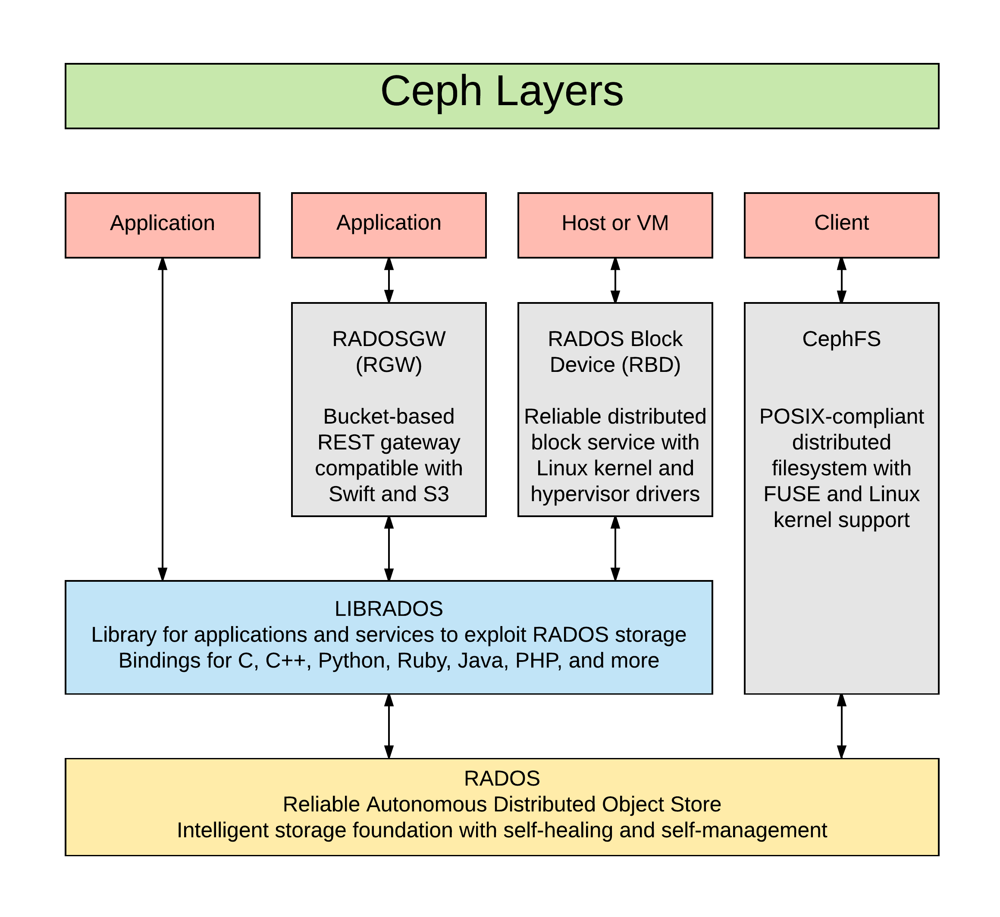

# CEPH RADOS (Reliable Autonomic Distributed Object Store)

Lớp RADOS giữ vai trò đặc biệt quan trọng trong kiến trúc Ceph, là trái tim của hệ thống lưu trữ CEPH. RADOS cung cấp tất cả các tính năng của Ceph:
- Lưu trữ object phân tán
- Sẵn sàng cao
- Tin cậy
- Không có SPOF (Single point of failure)
- Tự sửa lỗi
- Tự quản lý

Các phương thức truy xuất Ceph, như RBD, CephFS, RADOSGW và LIBRADOS đều hoạt động trên lớp RADOS.



Khi Ceph cluster nhận một yêu cầu ghi từ người dùng, thuật toán CRUSH tính toán vị trí và thiết bị mà dữ liệu sẽ được ghi vào. Các thông tin này được đưa lên lớp RADOS để xử lý. Dựa vào quy tắc của CRUSH, RADOS phân tán dữ liệu lên tất cả các node dưới dạng các object, phân chia lưu trữ dưới các [Placement Group](pg.md). Cuối cùng, các object này được lưu tại các OSD.

RADOS khi cấu hình với số nhân bản nhiều hơn hai, sẽ chịu trách nhiệm về độ tin cậy của dữ liệu. Nó sao chép object, tạo các bản sao và lưu trữ tại các zone khác nhau, do đó các bản ghi giống nhau không nằm trên cùng 1 zone. RADOS đảm bảo có nhiều hơn một bản copy của object trong RADOS cluster.

RADOS cũng đảm bảo object luôn nhất quán. Trong trường hợp object không nhất quán, tiến trình khôi phục sẽ chạy. Tiến trình này chạy tự động và trong suốt với người dùng, do đó mang lại khả năng tự sửa lỗi và tự quản lý cho Ceph. 

RADOS có 2 phần: phần thấp không tương tác trực tiếp với giao diện người dùng, và phần cao hơn có tất cả giao diện người dùng.

RADOS lưu dữ liệu dưới trạng thái các object trong pool. 

Để liệt kê danh sách các pool:
```sh
rados lspools
```

Để liệt kê các object trong pool:
```sh
rados -p {pool-name} ls
```

Để kiểm tra tài nguyên sử dụng:
```sh
rados df
```

Lớp `LIBRADOS` là thư viện C cho phép ứng dụng làm việc trực tiếp với RADOS, bypass qua các lớp khác để tương tác với Ceph Cluste. Librados là thư viện cho RADOS, cung cấp các hàm API, giúp ứng dụng tương tác trực tiếp và truy xuất song song vào cluster. Ứng dụng có thể mở rộng các giao thức của nó để truy cập vào RADOS bằng cách sử dụng librados. Các thư viện tương tự cũng sẵn sàng cho C++, Java, Python, Ruby, PHP. Librados là nền tảng cho các service giao diện khác chạy bên trên, gồm Ceph block device, Ceph filesystem, Ceph RADOS Gateway. Librados cung cấp rất nhiều API, các phương thức lưu trữ key/value trong object. API hỗ trợ *atomic-single-object* bằng cách update dữ liệu, key và các thuộc tính.

Tương tác trực tiếp với RADOS Cluster qua thư viện librados giúp tăng hiệu năng của ứng dụng. librados mang lại sự thuận lợi khi cung cấp PaaS và SaaS.

RADOS có 2 thành phần lõi:
- [CEPH Monitor](ceph-mon.md)
- [CEPH OSD](ceph-osd.md)