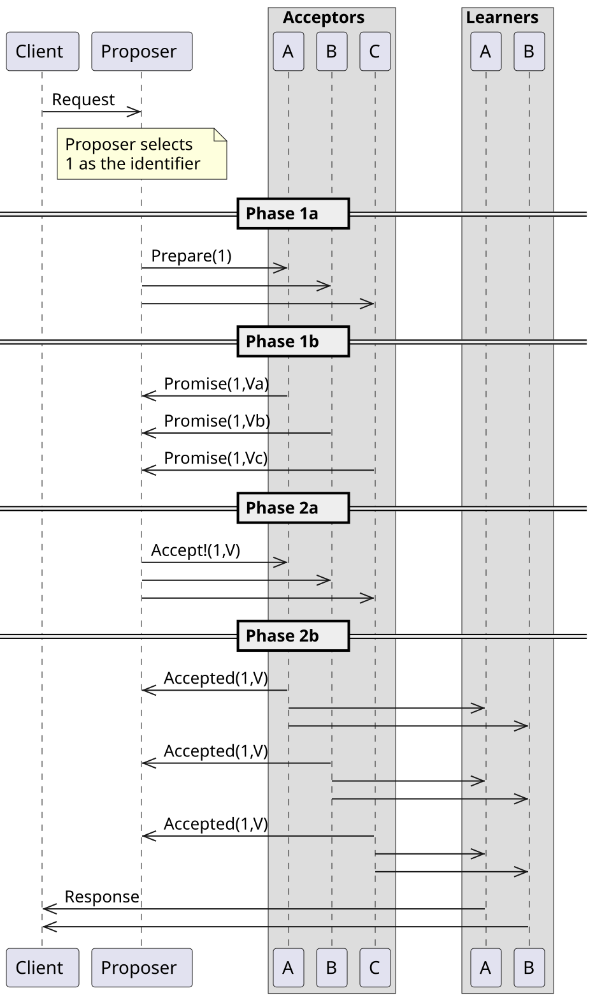

# Thuật toán PAXOS

## Giới thiệu
- Trong một mạng, để đánh giá xem một process failure cần dựa trên kết quả đánh giá của đa số processes khác.
- Giao thức PAXOS ra đời để giải quyết vấn đề đánh giá này.
- Một process được coi là failure khi có nhiều hơn một nửa các processes nhận thấy rằng process đó đã failure (lý do có thể do mất kết nối, không running, etc)

## Các định nghĩa
- Có 3 roles mà các process có thể có: `proposer`,  `acceptor` và `learner`.
	- `proposer`: là process đề xuất các giá trị. Đa số thời gian, chỉ có một process đóng vai trò `proposer`, như vậy nó cũng được gọi là leader
	- `acceptor`: `acceptor` có thể accept các giá trị đề xuất. Một tập hợp các chấp nhận đại diện cho đa số được gọi là quorum. Khi một đề xuất đã được chấp nhận bởi quorum, chúng ta nói rằng đề xuất này đã được chọn. Có nghĩa là khi một đề xuất được accept bởi đa số các processes (hơn một nửa) thì đề xuất đó đã được chọn.
	- `learner`: sau khi đề xuất được chọn, `proposer` thông báo giá trị đến xuất đến cho các processes, các processes đó được gọi là `learner`.

## Giao thức
- Các giá trị đề xuất có nhãn duy nhất, nhãn là các số tự nhiên được sử dụng để sắp xếp các đề xuất.
- Giao thức paxos có 2 pha. Trong pha đầu, leader sẽ lắng nghe nếu có bất kỳ giá trị nào được đồng ý bởi các `acceptors`. Sau đó nó sẽ chọn một giá trị đó sẽ đảm bảo sự chính xác của thuật toán. Trong pha thứ hai, giá trị đề xuất được chọn từ giai đoạn 1 đến được đẩy đến cho `acceptor`. Sau khi một số lượng lớn các acceptor thừa nhận leader cho rằng giá trị đề xuất được chấp nhận, leader có thể thông báo cho `learner`.
  
- Cụ thể hơn, giao thức như sau:
- Pha 1, chuẩn bị:
	- `proposer`: Thứ nhất, `proposer` chọn một số duy nhất và quảng bá yêu cầu với nhãn `n` chuẩn bị cho `acceptors`.
	- `acceptor`: Khi một `acceptor` nhận một yêu cầu chuẩn bị với nhãn `n`, nó sẽ bỏ qua nếu nó đã nhận được yêu cầu chuẩn bị với nhãn cao hơn. Nếu không, nó sẽ không nhận bất kỳ yêu cầu nào có nhãn thấp hơn kể từ bây giờ (ngay sau khi nhận được nhãn). 
- Pha 2, đồng ý:
	- `proposer`: Nếu `proposer` nhận được phản hồi từ số quorum của `acceptors`, nó sẽ lựa chọn, trong số tất cả các đề nghị trả lại, đề nghị đó có nhãn cao nhất. `v` là giá trị của đề xuất đó. `Proposer` sau đó sẽ gửi yêu cầu chấp nhận cho `acceptor` có giá trị v, và nhãn n. nếu không nhận được trả lời từ đa số `acceptors`, nó sẽ quay lại pha 1.
	- `Acceptor`: Nếu một `acceptor` nhận được một yêu cầu chấp nhận có giá trị v và nhãn n, nó chấp nhận yêu cầu này, trừ khi nó đã đáp ứng một số yêu cầu chuẩn bị khác với nhãn cao hơn n. Nếu `acceptor` chấp nhận yêu cầu, nó sẽ gửi một phản hồi thông báo cho proposer. Nếu `proposer` nhận được một xác nhận quorum, thì bây giờ nó có thể quảng bá giá trị cho `learner`.

## When rounds fail

Các vòng có thể thất bại khi nhiều Proposer gửi các thông điệp Prepare mâu thuẫn, hoặc khi Proposer không nhận được quorum các phản hồi (Promise hoặc Accepted). Trong những trường hợp này, một vòng mới phải được bắt đầu với một số đề xuất cao hơn.

## Paxos có thể sử dụng để lựa chọn 1 leader
Lưu ý rằng trong Paxos, một Proposer có thể đề xuất "I am the leader" (hoặc ví dụ, "Proposer X is the leader"). Vì các đảm bảo về sự đồng thuận và tính hợp lệ của Paxos, nếu đề xuất này được một Quorum chấp nhận, thì Proposer đó sẽ được tất cả các nút còn lại biết đến như là một leader. Điều này đáp ứng yêu cầu của việc bầu chọn người lãnh đạo, vì luôn có một nút tin rằng mình là người lãnh đạo và một nút được biết đến là người lãnh đạo tại mọi thời điểm.

## Representation of the flow of messages in Paxos

### Basic Paxos without failures

In the diagram below, there is 1 Client, 1 Proposer, 3 Acceptors (i.e. the Quorum size is 3) and 2 Learners (represented by the 2 vertical lines). This diagram represents the case of a first round, which is successful (i.e. no process in the network fails).

Here, V is the last of (Va, Vb, Vc).

### Error cases in basic Paxos

The simplest error cases are the failure of an Acceptor (when a Quorum of Acceptors remains alive) and failure of a redundant Learner. In these cases, the protocol requires no "recovery" (i.e. it still succeeds): no additional rounds or messages are required, as shown below (in the next two diagrams/cases).

### Basic Paxos when an Acceptor fails

In the following diagram, one of the Acceptors in the Quorum fails, so the Quorum size becomes 2. In this case, the Basic Paxos protocol still succeeds.

## Tài liệu tham khảo

- https://en.wikipedia.org/wiki/Paxos_(computer_science)