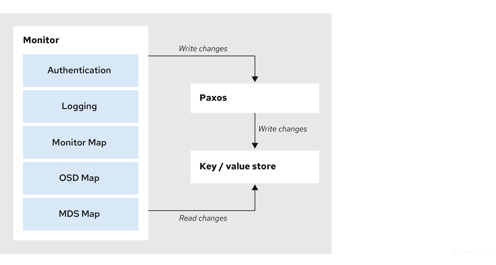

# Thuật toán PAXOS

## Giới thiệu
- Trong một mạng, để đánh giá xem một process failure cần dựa trên kết quả đánh giá của đa số processes khác.
- Giao thức PAXOS ra đời để giải quyết vấn đề đánh giá này.
- Một process được coi là failure khi có nhiều hơn một nửa các processes nhận thấy rằng process đó đã failure (lý do có thể do mất kết nối, không running, etc)

## PAXOS in CEPH

### Problem
Trước khi Ceph clients có thể đọc hoặc ghi dữ liệu, nó buộc phải contact với Ceph Monitor để có được bản sao mới nhất của cluster map. Ceph Storage Cluster hoàn toàn có thể hoạt động với 1 monitor duy nhất, tuy nhiên điều này lại dẫn đến a single point of failure (nếu monitors down thì Ceph clients không thể đọc hoặc ghi dữ liệu).

### Method 
Để tăng độ tin cậy và khả năng chịu lỗi Ceph cung cấp 1 cluster of monitor. Trong cluster of monitors, độ trễ (latency) và các lỗi khác có thể khiến monitors bị tụt lại ở phía sau so với trạng thái của cluster. Vì vậy, Ceph phải có sự thống nhất giữa các monitors. 

Để làm được điều này Ceph sử dụng biến thể thuật toán Paxos (blockchain), được sử dụng để đảm bảo tính nhất quán mạnh mẽ (strong consistency) giữa các Ceph Monitor. Thuật toán này yêu cầu phần lớn các monitor cần trong trạng thái active, dựa trên `Majority rule` của Paxos là nếu xử lý `m` monitor bị fail ta cần `2m+1` monitor. 
```
Ví dụ nếu cluster có 2 monitor thì sẽ không xử lý được khi 1 trong monitor bị fail nhưng nếu là 3 monitors thì sẽ xử lý được 1 monitor khi nó fail, 4 monitor xử lý được 1 và 5 monitor xử lý được 2. Vì vậy tổng số lượng monitor nên là số lẻ để tối ưu. Số lượng monitors tối thiểu trong production nên là 3 và hiếm khi lên 7 monitor hoặc nhiều hơn. Ngoài ra, Ceph Monitors nodes cần NTP để đồng bộ thời gian với nhau.
```



### 1. Đảm bảo tính nhất quán của Cluster Map

- Cluster Map là trung tâm thông tin của hệ thống Ceph, Ceph OSD và Ceph Clients sẽ có các thông tin về cluster topology bao gồm dữ liệu về các Monitor Map, OSD Map, PG Map, Crush Map, MDS Map. 
  - The Monitor Map: Chứa `fsid` (cluster ID), vị trí (position), địa chỉ và cổng (port) của mỗi monitor. Nó cũng cho biết map epoch (phiên bản map tại 1 thời điểm) hiện tại, thời điểm map được tạo, và lần cuối thay đổi. Để xem monitor map, ta có thể sử dụng câu lệnh `ceph mon dump`.
  - The OSD Map: Chứa `fsid`, danh sách pools, số lượng nhân bản (replica sizes), PG numbers, a list of OSDs and their status (e.g., up, in), thời gian map được tạo và lần cuối thay đổi. Để xem OSD map, ta có thể sử dụng câu lệnh `ceph osd dump`.
  - The PG Map: Chứa PG version, the last OSD map epoch, the full ratios, and details on each placement group such as the PG ID, the Up Set, the Acting Set, trạng thái của PG (e.g., `active + clean`), và thống kê dữ liệu sử dụng cho từ pool (data usage statistics for each pool).
  - The CRUSH Map: Chứa danh sách các thiết bị lưu trữ (storage devices), the failure domain hierarchy (e.g., device, host, rack, row, room, etc.) và rules khi lưu trữ dữ liệu. Để xem CRUSH map, ta dùng câu lệnh ceph osd getcrushmap -o {comp-crushmap-filename}, và sau đó để `decompile` map ta chạy `crushtool -d {comp-crushmap-filename} -o {decomp-crushmap-filename}`. Lúc này ta có thể xem map ở trong file `{decomp-crushmap-filename}` bằng cách sử dụng trình soạn thảo hoặc lệnh cat.
  - The MDS Map: Chứa MDS map epoch hiện tại, thời điểm map được tạo và lần cuối thay đổi. Nó cũng có pool để lưu trữ metadata, a list of metadata servers, and which metadata servers are `up and in`. Để xem OSD map, ta có thể sử dụng câu lệnh `ceph fs dump`.

- Khi xảy ra thay đổi, như thêm/xóa OSD, tạo pool mới, hoặc cập nhật CRUSH map, Paxos đảm bảo rằng tất cả các Ceph Monitor đồng thuận về phiên bản mới nhất của Cluster Map. Điều này ngăn ngừa tình trạng mâu thuẫn giữa các monitor.

### 2. Quản lý các thay đổi thông qua "Paxos Propose"

- Khi có thay đổi trong hệ thống (ví dụ, tạo pool mới qua lệnh ceph osd pool create), thay đổi này được đưa vào hàng đợi "pending changes".
- Những thay đổi trong hàng đợi sẽ được xử lý trong khoảng thời gian được định nghĩa bởi tham số paxos propose interval (mặc định là 1 giây). Điều này giúp giảm tải xử lý và ngăn việc ghi quá nhiều thay đổi nhỏ liên tục vào hệ thống.

### 3. Ghi trạng thái nhất quán vào kho key-value (RocksDB)

Paxos ghi tất cả các thay đổi vào RocksDB (một cơ sở dữ liệu key-value) trên mỗi Ceph Monitor. Điều này đảm bảo:
- Tính bền vững: Các thay đổi được ghi vào RocksDB sẽ không bị mất ngay cả khi hệ thống gặp sự cố.
- Khả năng phục hồi: Các Ceph Monitor mới hoặc khôi phục lại sau lỗi có thể đồng bộ hóa với trạng thái hiện tại thông qua RocksDB.

### 4. Đồng bộ giữa các Monitor
Trong trường hợp một Ceph Monitor bị lỗi hoặc mới tham gia cụm, Paxos đảm bảo rằng monitor này sẽ nhận được bản sao chính xác của trạng thái hiện tại từ các monitor còn lại, nhờ khả năng đồng bộ hóa dựa trên RocksDB.

### 5. Hỗ trợ trong quá trình mở rộng hệ thống
Ceph có khả năng mở rộng quy mô rất lớn mà vẫn duy trì tính nhất quán. Paxos giúp đạt được điều này bằng cách đảm bảo rằng các thay đổi trong hệ thống luôn được các monitor đồng thuận trước khi áp dụng

## See more below

## Các định nghĩa
- Có 3 roles mà các process có thể có: `proposer`,  `acceptor` và `learner`.
	- `proposer`: là process đề xuất các giá trị. Đa số thời gian, chỉ có một process đóng vai trò `proposer`, như vậy nó cũng được gọi là leader
	- `acceptor`: `acceptor` có thể accept các giá trị đề xuất. Một tập hợp các chấp nhận đại diện cho đa số được gọi là quorum. Khi một đề xuất đã được chấp nhận bởi quorum, chúng ta nói rằng đề xuất này đã được chọn. Có nghĩa là khi một đề xuất được accept bởi đa số các processes (hơn một nửa) thì đề xuất đó đã được chọn.
	- `learner`: sau khi đề xuất được chọn, `proposer` thông báo giá trị đến xuất đến cho các processes, các processes đó được gọi là `learner`.

## Giao thức
- Các giá trị đề xuất có nhãn duy nhất, nhãn là các số tự nhiên được sử dụng để sắp xếp các đề xuất.
- Giao thức paxos có 2 pha. Trong pha đầu, leader sẽ lắng nghe nếu có bất kỳ giá trị nào được đồng ý bởi các `acceptors`. Sau đó nó sẽ chọn một giá trị đó sẽ đảm bảo sự chính xác của thuật toán. Trong pha thứ hai, giá trị đề xuất được chọn từ giai đoạn 1 đến được đẩy đến cho `acceptor`. Sau khi một số lượng lớn các acceptor thừa nhận leader cho rằng giá trị đề xuất được chấp nhận, leader có thể thông báo cho `learner`.
  
- Cụ thể hơn, giao thức như sau:
- Pha 1, chuẩn bị:
	- `proposer`: Thứ nhất, `proposer` chọn một số duy nhất và quảng bá yêu cầu với nhãn `n` chuẩn bị cho `acceptors`.
	- `acceptor`: Khi một `acceptor` nhận một yêu cầu chuẩn bị với nhãn `n`, nó sẽ bỏ qua nếu nó đã nhận được yêu cầu chuẩn bị với nhãn cao hơn. Nếu không, nó sẽ không nhận bất kỳ yêu cầu nào có nhãn thấp hơn kể từ bây giờ (ngay sau khi nhận được nhãn). 
- Pha 2, đồng ý:
	- `proposer`: Nếu `proposer` nhận được phản hồi từ số quorum của `acceptors`, nó sẽ lựa chọn, trong số tất cả các đề nghị trả lại, đề nghị đó có nhãn cao nhất. `v` là giá trị của đề xuất đó. `Proposer` sau đó sẽ gửi yêu cầu chấp nhận cho `acceptor` có giá trị v, và nhãn n. nếu không nhận được trả lời từ đa số `acceptors`, nó sẽ quay lại pha 1.
	- `Acceptor`: Nếu một `acceptor` nhận được một yêu cầu chấp nhận có giá trị v và nhãn n, nó chấp nhận yêu cầu này, trừ khi nó đã đáp ứng một số yêu cầu chuẩn bị khác với nhãn cao hơn n. Nếu `acceptor` chấp nhận yêu cầu, nó sẽ gửi một phản hồi thông báo cho proposer. Nếu `proposer` nhận được một xác nhận quorum, thì bây giờ nó có thể quảng bá giá trị cho `learner`.

## When rounds fail

Các vòng có thể thất bại khi nhiều Proposer gửi các thông điệp Prepare mâu thuẫn, hoặc khi Proposer không nhận được quorum các phản hồi (Promise hoặc Accepted). Trong những trường hợp này, một vòng mới phải được bắt đầu với một số đề xuất cao hơn.

## Paxos có thể sử dụng để lựa chọn 1 leader
Lưu ý rằng trong Paxos, một Proposer có thể đề xuất "I am the leader" (hoặc ví dụ, "Proposer X is the leader"). Vì các đảm bảo về sự đồng thuận và tính hợp lệ của Paxos, nếu đề xuất này được một Quorum chấp nhận, thì Proposer đó sẽ được tất cả các nút còn lại biết đến như là một leader. Điều này đáp ứng yêu cầu của việc bầu chọn người lãnh đạo, vì luôn có một nút tin rằng mình là người lãnh đạo và một nút được biết đến là người lãnh đạo tại mọi thời điểm.

## Representation of the flow of messages in Paxos

### Basic Paxos without failures

In the diagram below, there is 1 Client, 1 Proposer, 3 Acceptors (i.e. the Quorum size is 3) and 2 Learners (represented by the 2 vertical lines). This diagram represents the case of a first round, which is successful (i.e. no process in the network fails).


Here, V is the last of (Va, Vb, Vc).

### Error cases in basic Paxos

The simplest error cases are the failure of an Acceptor (when a Quorum of Acceptors remains alive) and failure of a redundant Learner. In these cases, the protocol requires no "recovery" (i.e. it still succeeds): no additional rounds or messages are required, as shown below (in the next two diagrams/cases).

### Basic Paxos when an Acceptor fails

In the following diagram, one of the Acceptors in the Quorum fails, so the Quorum size becomes 2. In this case, the Basic Paxos protocol still succeeds.

```
Client   Proposer      Acceptor     Learner
   |         |          |  |  |       |  |
   X-------->|          |  |  |       |  |  Request
   |         X--------->|->|->|       |  |  Prepare(1)
   |         |          |  |  !       |  |  !! FAIL !!
   |         |<---------X--X          |  |  Promise(1,{Va, Vb, null})
   |         X--------->|->|          |  |  Accept!(1,V)
   |         |<---------X--X--------->|->|  Accepted(1,V)
   |<---------------------------------X--X  Response
   |         |          |  |          |  |
```

### Basic Paxos when a redundant learner fails

In the following case, one of the (redundant) Learners fails, but the Basic Paxos protocol still succeeds.

```
Client Proposer         Acceptor     Learner
   |         |          |  |  |       |  |
   X-------->|          |  |  |       |  |  Request
   |         X--------->|->|->|       |  |  Prepare(1)
   |         |<---------X--X--X       |  |  Promise(1,{Va,Vb,Vc})
   |         X--------->|->|->|       |  |  Accept!(1,V)
   |         |<---------X--X--X------>|->|  Accepted(1,V)
   |         |          |  |  |       |  !  !! FAIL !!
   |<---------------------------------X     Response
   |         |          |  |  |       |
```

### Basic Paxos when a Proposer fails

In this case, a Proposer fails after proposing a value, but before the agreement is reached. Specifically, it fails in the middle of the Accept message, so only one Acceptor of the Quorum receives the value. Meanwhile, a new Leader (a Proposer) is elected (but this is not shown in detail). Note that there are 2 rounds in this case (rounds proceed vertically, from the top to the bottom).

```
Client  Proposer        Acceptor     Learner
   |      |             |  |  |       |  |
   X----->|             |  |  |       |  |  Request
   |      X------------>|->|->|       |  |  Prepare(1)
   |      |<------------X--X--X       |  |  Promise(1,{Va, Vb, Vc})
   |      |             |  |  |       |  |
   |      |             |  |  |       |  |  !! Leader fails during broadcast !!
   |      X------------>|  |  |       |  |  Accept!(1,V)
   |      !             |  |  |       |  |
   |         |          |  |  |       |  |  !! NEW LEADER !!
   |         X--------->|->|->|       |  |  Prepare(2)
   |         |<---------X--X--X       |  |  Promise(2,{V, null, null})
   |         X--------->|->|->|       |  |  Accept!(2,V)
   |         |<---------X--X--X------>|->|  Accepted(2,V)
   |<---------------------------------X--X  Response
   |         |          |  |  |       |  |
```

### Basic Paxos when multiple Proposers conflict

The most complex case is when multiple Proposers believe themselves to be Leaders. For instance, the current leader may fail and later recover, but the other Proposers have already re-selected a new leader. The recovered leader has not learned this yet and attempts to begin one round in conflict with the current leader. In the diagram below, 4 unsuccessful rounds are shown, but there could be more (as suggested at the bottom of the diagram).

```
Client   Proposer       Acceptor     Learner
   |      |             |  |  |       |  |
   X----->|             |  |  |       |  |  Request
   |      X------------>|->|->|       |  |  Prepare(1)
   |      |<------------X--X--X       |  |  Promise(1,{null,null,null})
   |      !             |  |  |       |  |  !! LEADER FAILS
   |         |          |  |  |       |  |  !! NEW LEADER (knows last number was 1)
   |         X--------->|->|->|       |  |  Prepare(2)
   |         |<---------X--X--X       |  |  Promise(2,{null,null,null})
   |      |  |          |  |  |       |  |  !! OLD LEADER recovers
   |      |  |          |  |  |       |  |  !! OLD LEADER tries 2, denied
   |      X------------>|->|->|       |  |  Prepare(2)
   |      |<------------X--X--X       |  |  Nack(2)
   |      |  |          |  |  |       |  |  !! OLD LEADER tries 3
   |      X------------>|->|->|       |  |  Prepare(3)
   |      |<------------X--X--X       |  |  Promise(3,{null,null,null})
   |      |  |          |  |  |       |  |  !! NEW LEADER proposes, denied
   |      |  X--------->|->|->|       |  |  Accept!(2,Va)
   |      |  |<---------X--X--X       |  |  Nack(3)
   |      |  |          |  |  |       |  |  !! NEW LEADER tries 4
   |      |  X--------->|->|->|       |  |  Prepare(4)
   |      |  |<---------X--X--X       |  |  Promise(4,{null,null,null})
   |      |  |          |  |  |       |  |  !! OLD LEADER proposes, denied
   |      X------------>|->|->|       |  |  Accept!(3,Vb)
   |      |<------------X--X--X       |  |  Nack(4)
   |      |  |          |  |  |       |  |  ... and so on ...
```

### Basic Paxos where an Acceptor accepts Two Different Values

In the following case, one Proposer achieves acceptance of value V1 by one Acceptor before failing. A new Proposer prepares the Acceptors that never accepted V1, allowing it to propose V2. Then V2 is accepted by all Acceptors, including the one that initially accepted V1.

```
Proposer    Acceptor     Learner
 |  |       |  |  |       |  |
 X--------->|->|->|       |  |  Prepare(1)
 |<---------X--X--X       |  |  Promise(1,{null,null,null})
 x--------->|  |  |       |  |  Accept!(1,V1)
 |  |       X------------>|->|  Accepted(1,V1)
 !  |       |  |  |       |  |  !! FAIL !!
    |       |  |  |       |  |
    X--------->|->|       |  |  Prepare(2)
    |<---------X--X       |  |  Promise(2,{null,null})
    X------>|->|->|       |  |  Accept!(2,V2)
    |<------X--X--X------>|->|  Accepted(2,V2)
    |       |  |  |       |  |
```

### Basic Paxos where a multi-identifier majority is insufficient

In the following case, one Proposer achieves acceptance of value V1 of one Acceptor before failing. A new Proposer prepares the Acceptors that never accepted V1, allowing it to propose V2. This Proposer is able to get one Acceptor to accept V2 before failing. A new Proposer finds a majority that includes the Acceptor that has accepted V1, and must propose it. The Proposer manages to get two Acceptors to accept it before failing. At this point, three Acceptors have accepted V1, but not for the same identifier. Finally, a new Proposer prepares the majority that has not seen the largest accepted identifier. The value associated with the largest identifier in that majority is V2, so it must propose it. This Proposer then gets all Acceptors to accept V2, achieving consensus.

```
Proposer           Acceptor        Learner
 |  |  |  |       |  |  |  |  |       |  |
 X--------------->|->|->|->|->|       |  |  Prepare(1)
 |<---------------X--X--X--X--X       |  |  Promise(1,{null,null,null,null,null})
 x--------------->|  |  |  |  |       |  |  Accept!(1,V1)
 |  |  |  |       X------------------>|->|  Accepted(1,V1)
 !  |  |  |       |  |  |  |  |       |  |  !! FAIL !!
    |  |  |       |  |  |  |  |       |  |
    X--------------->|->|->|->|       |  |  Prepare(2)
    |<---------------X--X--X--X       |  |  Promise(2,{null,null,null,null})
    X--------------->|  |  |  |       |  |  Accept!(2,V2)
    |  |  |       |  X--------------->|->|  Accepted(2,V2)
    !  |  |       |  |  |  |  |       |  |  !! FAIL !!
       |  |       |  |  |  |  |       |  | 
       X--------->|---->|->|->|       |  |  Prepare(3)
       |<---------X-----X--X--X       |  |  Promise(3,{V1,null,null,null})
       X--------------->|->|  |       |  |  Accept!(3,V1)
       |  |       |  |  X--X--------->|->|  Accepted(3,V1)
       !  |       |  |  |  |  |       |  |  !! FAIL !!
          |       |  |  |  |  |       |  |
          X------>|->|------->|       |  |  Prepare(4)
          |<------X--X--|--|--X       |  |  Promise(4,{V1(1),V2(2),null})
          X------>|->|->|->|->|       |  |  Accept!(4,V2)
          |       X--X--X--X--X------>|->|  Accepted(4,V2)
```

### Basic Paxos where new Proposers cannot change an existing consensus

In the following case, one Proposer achieves acceptance of value V1 of two Acceptors before failing. A new Proposer may start another round, but it is now impossible for that proposer to prepare a majority that doesn't include at least one Acceptor that has accepted V1. As such, even though the Proposer doesn't see the existing consensus, the Proposer's only option is to propose the value already agreed upon. New Proposers can continually increase the identifier to restart the process, but the consensus can never be changed.

```
Proposer    Acceptor     Learner
 |  |       |  |  |       |  |
 X--------->|->|->|       |  |  Prepare(1)
 |<---------X--X--X       |  |  Promise(1,{null,null,null})
 x--------->|->|  |       |  |  Accept!(1,V1)
 |  |       X--X--------->|->|  Accepted(1,V1)
 !  |       |  |  |       |  |  !! FAIL !!
    |       |  |  |       |  |
    X--------->|->|       |  |  Prepare(2)
    |<---------X--X       |  |  Promise(2,{V1,null})
    X------>|->|->|       |  |  Accept!(2,V1)
    |<------X--X--X------>|->|  Accepted(2,V1)
    |       |  |  |       |  |
```

## Multi-Paxos (later)
## Cheap Paxos (later)
## Fast Paxos (later)
## Generalized Paxos (later)
## Byzantine Paxos (later)