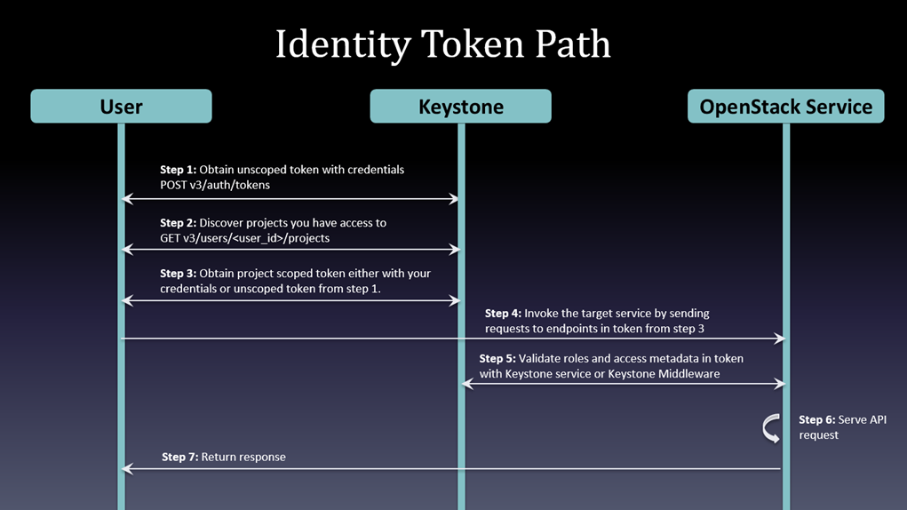
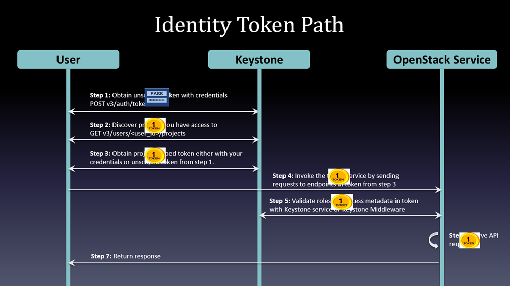

# 1. Openstack Indentify ( Keystone )

## 1. Khái niệm Keystone
  
- Keystone là OpenStack project cung cấp các dịch vụ Identity, Token, Catalog, Policy cho các project khác trong OpenStack. 
- Keystone có 2 phiển bản gồm

| V2           | V3                                                                                               |
| ------------ | ------------------------------------------------------------------------------------------------ |
| sử dụng UUID | sử dụng PKI, mỗi mã thông báo đại diện cho một cặp khóa mở và đóng để xác minh chéo và xác thực. |

Hai tính năng chính của Keystone:
-   User Management: keystone xác thực tài khoản người dùng và chỉ định xem người dùng có quyền được làm gì.
-   Service Catalog: Cung cấp một danh mục các dịch vụ sẵn sàng cùng với các API endpoints để truy cập các dịch vụ đó.
  
## 2. Cấu trúc trong Keystone

**2.1. Project**

-   Khái niệm chỉ sự gom gộp, cô lập các nguồn tài nguyên (server, images, etc.)
-  Các user được gắn role và truy cập sử dụng tài nguyên trong project
   -   role để quy định tài nguyên được phép truy cập trong project (khái niệm role assignment)
- Bản thân projects không sở hữu users hay groups mà users và groups được cấp quyền truy cập tới project sử dụng cơ chế gán role.
  
**2.2. Domain**
   -   Domain là tập hợp bao gồm các user, group, project
   -   Phân chia tài nguyên vào các "kho chứa" để sử dụng độc lập với các domain khác
   -   Mỗi domain có thể coi là sự phân chia về mặt logic giữa các tổ chức, doanh nghiệp trên cloud

**2.3. Users và User Groups**

-   User: người dùng sử dụng nguyên trong project, domain được phân bổ
-   Group: tập hợp các user , phân bổ tài nguyên
-   Role: các role gán cho user và user group trên các domain và project 

**2.4. Roles**

Khái niệm gắn liên với Authorization (ủy quyền), giới hạn các thao tác vận hành hệ thống và nguồn tài nguyên mà user được phép.  **Role được gán cho user và nó được gán cho user đó trên một project cụ thể. ("assigned to" user, "assigned on" project)**

**2.5. Token**

Token được sử dụng để xác thực tài khoản người dùng và ủy quyền cho người dùng khi truy cập tài nguyên (thực hiện các API call).  
Token bao gồm:
-   ID: định danh duy nhất của token trên DB
-   payload: là dữ liệu về người dùng (user được truy cập trên project nào, danh mục các dịch vụ sẵn sàng để truy cập cùng với endpoints truy cập các dịch vụ đó), thời gian khởi tạo, thời gian hết hạn, etc.

**2.6. Catalog**  

Là danh mục các dịch vụ để người dùng tìm kiếm và truy cập. Catalog chỉ ra các endpoints truy cập dịch vụ, loại dịch vụ mà người dùng truy cập cùng với tên tương ứng, etc. Từ đó người dùng có thể request khởi tạo VM và lưu trữ object.

**2.6. Services**

Là một dịch  khác như Nova, Glance, Swift có cung cấp các endpoint cho phép người dùng truy cập, sử dụng tài nguyên

**2.7. Openstack Client** 

Là một command-line , bao nhiều nhiều dịch vụ gồm Indentify API, cho phép làm việc với keystone

## 2. Indentify Service

Identity service trong keystone cung cấp các Actors. Nó có thể tới từ nhiều dịch vụ khác nhau như SQL, LDAP và Federated Identity Providers.

### 2.1. SQL

-   Keystone có tùy chọn cho phép lưu trữ actors trong SQL. Nó hỗ trợ các database như MySQL, PostgreSQL, và DB2.    
-   Keystone sẽ lưu những thông tin như tên, mật khẩu và mô tả.
-   Những cài đặt của các database này nằm trong file config của keystone    
-   Về bản chất, Keystone sẽ hoạt động như 1 Identity Provider. Vì thế đây sẽ không phải là lựa chọn tốt nhất trong một vài trường hợp, nhất là đối với các khách hàng là doanh nghiệp
-   Sau đây là ưu nhược điểm:
  
Ưu điểm:
-   Dễ set up
-   Quản lí users, groups thông qua OpenStack APIs.

Nhược điểm:
-   Keystone không nên là một Identity Provider
-   Hỗ trợ cả mật khẩu yếu
-   Hầu hết các doanh nghiệp đều sử dụng LDAP server
-   Phải ghi nhớ username và password.

### 2.2. LADP
-   Keystone sẽ truy cập tới LDAP như bất kì ứng dụng khác (System Login, Email, Web Application, etc.).
-   Các cài đặt kết nối sẽ được lưu trong file config của keystone. Các cài đặt này cũng bao gồm tùy chọn cho phép keystone được ghi hoặc chỉ đọc dữ liệu từ LDAP.
-   Thông thường LDAP chỉ nên cho phép các câu lệnh đọc, ví dụ như tìm kiếm user, group và xác thực.
-   Nếu sử dụng LDAP như một read-only Identity Backends thì Keystone cần có quyền sử dụng LDAP.

Ưu điểm:
-   Không cần sao lưu tài khoản người dùng.
-   Keystone không hoạt động như một Identity Provider.

Nhược điểm:
-   Keystone có thể thấy mật khẩu người dùng, lúc mật khẩu được yêu cầu authentication.

### 2.3. Multiple Backends
-   Kể từ bản Juno thì Keystone đã hỗ trợ nhiều Identity backends cho V3 Identity API. Nhờ vậy mà mỗi một domain có thể có một identity source (backend) khác nhau.
-   Domain mặc định thường sử dụng SQL backend bởi nó được dùng để lưu các host service accounts. Service accounts là các tài khoản được dùng bởi các dịch vụ OpenStack khác nhau để tương tác với Keystone.
-   Việc sử dụng Multiple Backends được lấy cảm hứng trong các môi trường doanh nghiệp, LDAP chỉ được sử dụng để lưu thông tin của các nhân viên bởi LDAP admin có thể không ở cùng một công ty với nhóm triển khai OpenStack. Bên cạnh đó, nhiều LDAP cũng có thể được sử dụng trong trường hợp công ty có nhiều phòng ban.

Ưu điểm:
-   Cho phép việc sử dụng nhiều LDAP để lưu tài khoản người dùng và SQL để lưu tài khoản dịch vụ
-   Sử dụng lại LDAP đã có.

Nhược điểm:
-   Phức tạp trong khâu set up
-   Xác thực tài khoản người dùng phải trong miền scoped

### 2.4. Identity Providers
-   Kể từ bản Icehouse thì Keystone đã có thể sử dụng các liên kết xác thực thông qua module Apache cho các Identity Providers khác nhau.
-   Cơ bản thì Keystone sẽ sử dụng một bên thứ 3 để xác thực, nó có thể là những phần mềm sử dụng các backends (LDAP, AD, MongoDB) hoặc mạng xã hội (Google, Facebook, Twitter).

Ưu điểm:

-   Có thể tận dụng phần mềm và cơ sở hạ tầng cũ để xác thực cũng như lấy thông tin của users.
-   Tách biệt keystone và nhiệm vụ định danh, xác thực thông tin.
-   Mở ra cánh cửa mới cho những khả năng mới ví dụ như single signon và hybrid cloud
-   Keystone không thể xem mật khẩu, mọi thứ đều không còn liên quan tới keystone.

Nhược điểm:
-   Phức tạp nhất về việc setup

## 3 . Keystone WorkFlow

